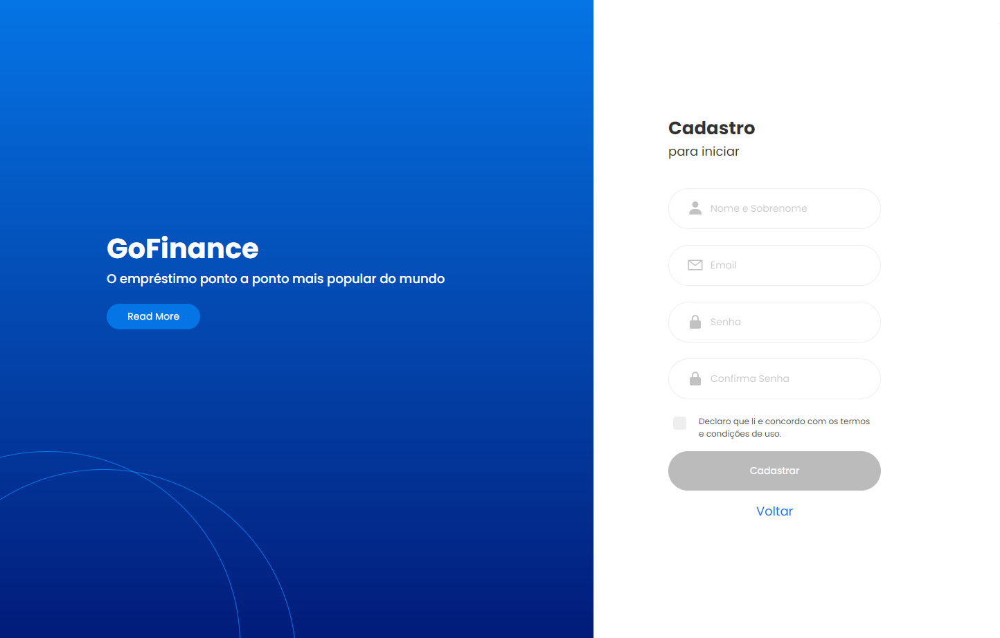
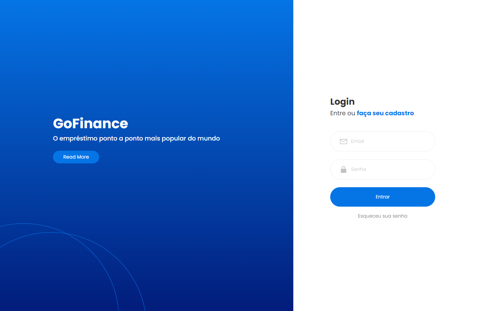

# GoFinance

## Índice
- <a href="#sobre-o-projeto">Sobre o Projeto</a>
- <a href="#layout">Layout</a>
- <a href="#recursos">Recursos</a>
- <a href="#como-executar-o-projeto">Como Executar o Projeto</a>
- <a href="#tecnologias-utilizadas">Tecnologias Utilizadas</a>
- <a href="#autor">Autor</a>

## Sobre o Projeto

O GoFinance é uma aplicação web para ajudar os usuários a gerenciar suas transações financeiras, categorizando e acompanhando entradas e saídas de dinheiro.
Ele oferece uma interface simples e intuitiva para que os usuários possam adicionar, visualizar e gerenciar suas transações financeiras. Ele exibe um resumo das entradas, saídas e saldo geral, proporcionando uma visão rápida do estado financeiro.

## Layout



## Recursos

- Efetuar o cadastro
- Efetuar o login
- Visualizar suas transações

## Como Executar o Projeto

```bash
# Clone este repositório
$ git@git.raroacademy.com.br:rafael.santos/projeto-react-semana06.git

# Instale as dependências
$ npm intall

# Inicie a aplicação
$ npm run dev
```
## Tecnologias Utilizadas

- React: Biblioteca de interface do usuário.
- TypeScript: Superset JavaScript para tipagem estática.
- CSS Modules: Abordagem de estilização por componente.
- React Router Dom
- Axios: Para fazer solicitações à API
- Yup: Para validação de formulários
- Formik: Para construção de formulários

## Autor

Desenvolvido por Rafael dos Santos!!